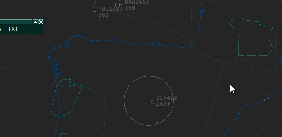
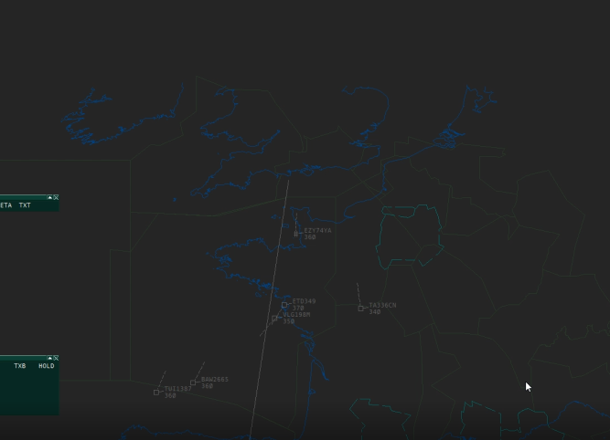
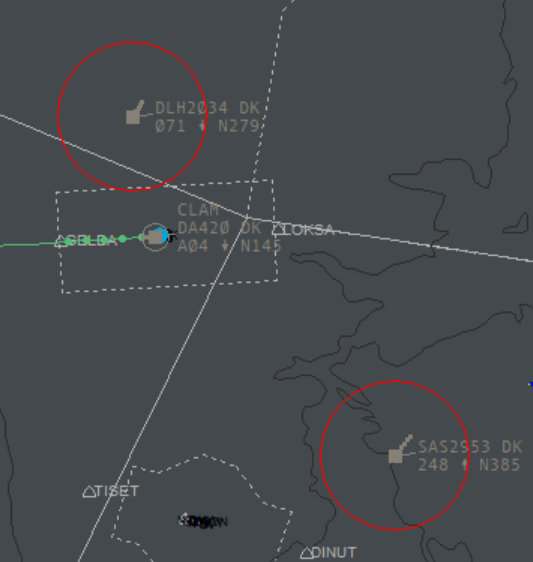
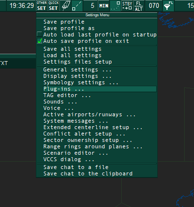
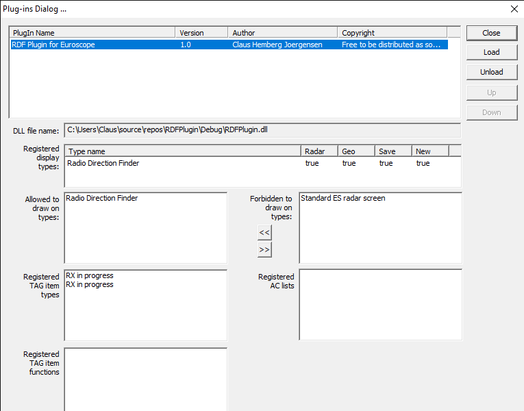

# RDF

## Support VectorAudio/0.5.0+

[VectorAudio](https://github.com/pierr3/VectorAudio) is an Audio-For-VATSIM ATC client for macOS and Linux. It provides better audio quality when EuroScope is running in a Windows virtual machine. This improved RDF plugin utilizes VectorAudio's SDK and sends HTTP GET request every second to get transmitting pilots *and controllers*.

## More Customizations

+ Random offset of circle to simulate measuring errors in real life.
+ Customizable circle radius in nautical miles (instead of pixels).
+ (Old feature) RGB settings for circle or line, and different color for concurrent transmission.

## Configurations

There are two ways to modify the plugin settings - by settings file and by commandline functions.

This table shows all configurable items.

|Entry Name|Command Line Keyword|Default Value|
|-|-|-|
|VectorAudioAddress|ADDRESS|127.0.0.1:49080|
|VectorAudioTimeout|TIMEOUT|300|
|VectorAudioRetryInterval|INTERVAL|5|
|RGB|RGB|255:255:255|
|ConcurrentTransmissionRGB|CTRGB|255:0:0|
|Radius|RADIUS|20|
|Threshold|THRESHOLD|-1|
|Precision|PRECISION|0|
|DrawControllers|CONTROLLER|0|

E.g. In settings files the default is like the following:

```text
PLUGINS
<eventually existing configuration lines>
RDF Plugin for Euroscope:VectorAudioAddress:127.0.0.1:49080
RDF Plugin for Euroscope:VectorAudioTimeout:300
RDF Plugin for Euroscope:VectorAudioRetryInterval:5
RDF Plugin for Euroscope:RGB:255:255:255
RDF Plugin for Euroscope:ConcurrentTransmissionRGB:255:0:0
RDF Plugin for Euroscope:Radius:20
RDF Plugin for Euroscope:Threshold:-1
RDF Plugin for Euroscope:Precision:0
RDF Plugin for Euroscope:DrawControllers:0
END
```

+ **VectorAudioAddress** should include address and port only. E.g. 127.0.0.1:49080 or localhost:49080, etc.
+ **VectorAudioTimeout** is in milliseconds. If any request takes longer time than it, the plugin will seize sending requests to VectorAudio until after a specified interval.
+ **VectorAudioRetryInterval** is in seconds. If the plugin disconnets from VectorAudio, it will attempt to re-establish connection every 5 seconds by default.
+ **RGB, ConcurrentTransmissionRGB**, see *Readme for Previous Version* below.
+ **Radius** is in nautical miles (if **Threshold**>0). The circle will get bigger and smaller when zooming in and out.
+ **Threshold** determines the behaviour of drawing. If radius (to draw in pixel) is smaller than **Threshold**, it won't be drawn into a circle but a direction line (same as the situation when the target is outside of displayed area). If **Threshold**<0, there won't be any zooming effect, but instead a fixed **Radius** in pixel.
+ **Precision** is in nautical miles. It is the double of standard deviation in a normal distrubution, which means 97.72% of offset won't be farther than **Precision**. Using 0 means no random offset at all.
+ **DrawControllers** is compatible with both VectorAudio and AFV. It is used to cover OBS pilots especially in shared cockpit. Other transimitting controllers will be circled as well but without offset. 0 means OFF and other numeric value means ON.

When EuroScope is running, you can reload settings in *Settings File Setup* and then enter ***".RDF RELOAD"*** (case-insensitive) in command line.

For command line configurations, use ***".RDF KEYWORD VALUE"***, e.g. ***".RDF CTRGB 0:255:255"***. Also all command line functions are case-insensitive.

## Credits

+ [pierr3/VectorAudio](https://github.com/pierr3/VectorAudio): initiative.
+ [LeoChen98](https://github.com/LeoChen98), [websterzh](https://github.com/websterzh): idea of using HTTP requests.
+ [chembergj/RDF](https://github.com/chembergj/RDF): basic drawings.
+ [vaccfr/CoFrance](https://github.com/vaccfr/CoFrance), [yhirose/cpp-httplib](https://github.com/yhirose/cpp-httplib): methods to make asynchronous http requests.

# Readme for Previous Version (until 1.2.4)

## Radio Direction Finder plugin for Euroscope - now with AFV (Audio for Vatsim) support

Having problems finding the tag for the aircraft, when the pilot calls you on your frequency? At least I have had challenges with this, when covering large sectors on Vatsim, especially FSS positions. Inspired by this video (https://www.youtube.com/watch?v=KpLKP_CxaLo), showing how RDF works at Eurocontrol, I have developed this plugin, letting Euroscope help you find the calling pilot.

Here is an example of, how you will get the same functionality as shown in the video: highlighting the calling aircraft by drawing a circle around the tag. 

   

   After the pilots transmission has ended, you can still get the tag highlighted by pressing the middle mouse button. 
   If the tag is outside the displayed area, a line will be drawed in the direction of the plane.
   
   

   In case of simultaneous transmissions, red circles will be drawn around each aircraft.

   


   
:warning: If you are already using the TopSky plugin, versions at or above 2.2.1 beta 8, you should NOT use the RDF plugin, since the RDF functionality is already integrated in the TopSky plugin. :warning:

## Installation of plugin

Prerequisites: 
* Microsoft Visual C++ Redistributable for Visual Studio 2015, 2017 and 2019 that can be found here: 
(https://support.microsoft.com/en-gb/help/2977003/the-latest-supported-visual-c-downloads)
* AFV Standalone Client version 1.6.32 or higher.


1. For your own sake: make a backup copy of your Euroscope folder with your settings, profiles, asr-files etc. (typically under Documents\Euroscope)
1. Download the plugin DLL from here: [RDFPlugin.DLL](https://raw.githubusercontent.com/chembergj/RDF/master/Release/RDFPlugin.dll), and move it to your Documents\Euroscope\Plugins folder
1. Start Euroscope. Click on the menu button "Other SET", and select the "Plug-ins..." menu item. 
1. The plugin dialog should now be open. Click "Load", and select the just downloaded "RDFPlugin.dll"
1. Click on the "RDF Plugin for Euroscope" line in the list, and move "Standard ES radar screen" from the "Forbidden to draw on types" list to the "Allowed to draw on types" list, by clicking the "<<"  button. It should something like this (besides the DLL filename directory, of course):

1. Click "Close". That's it. 

If you want the plugin to draw on other display types than just the "Standard ES radar screen", feel free to move them from the "Forbidden..." list to the "Allowed..." list.

No more *"Please say callsign again.."* :smile:

## How to use
1. If the "talking aircraft" is inside your radar view, a white circle is drawn around the tag. 
1. If the aircraft is outside your radar view, a line is drawn from the screen centre in the direction of the aircraft. Scroll in the direction and you will find the aircraft. 
1. In case you forgot, which aircraft just called, just press the middle button of your mouse, and the circle will be drawn again.
1. In case of simultaneous transmissions, the plugin works in the same way, except that a red color is used for drawing a circle around each aircraft or a line to each aircraft outside the radar view. 
## Configuration of color and radius
As default, the circle and line is drawn in white, and in case of simulatenous transmissions, in red. Default radius for RDF circle is 50. In case you want to customize this, open your plugin configuration file in a text editor. The name and location of the file can be found by clicking  "Other Set", in the menu click "Settings files setup".
Inside this file, you will probably see something like this:

```
PLUGINS
<eventually existing configuration lines>
END
```


Insert a new line before the END line, and paste this into the new line:

```
RDF Plugin for Euroscope:RGB:0:255:0
RDF Plugin for Euroscope:ConcurrentTransmissionRGB:0:255:0
RDF Plugin for Euroscope:Radius:60
```

...that is, so the file now looks like this:

```
PLUGINS
<eventually existing configuration lines>
RDF Plugin for Euroscope:RGB:0:255:0
RDF Plugin for Euroscope:ConcurrentTransmissionRGB:255:255:0
RDF Plugin for Euroscope:Radius:60
END
```

After restarting Euroscope, the circle and line drawn by the RDF plugin will now be green due to the R=0, G=255, B=0 values, and yellow for concurrent transmission due to the R=255, G=255, B=0 values. You can of course set it to anything you want, as long as each value is between 0 and 255, both inclusive. In case the plugin fails to parse the line for whatever the reason must be, it will fall back to use the default white and red color.

The circle radius will now also be slightly larger, 60 instead of default 50.

## Questions?
You can reach me on claus_hemberg.jorgensen (at) vatsim-scandinavia.org

(Disclaimer: this is my very first ES plugin, I might not have all the answers :smile: )

## Thanks
Credit for parts of the Standalone client communication code goes to Andy and his AfvBridge https://github.com/AndyTWF/afv-euroscope-bridge/
